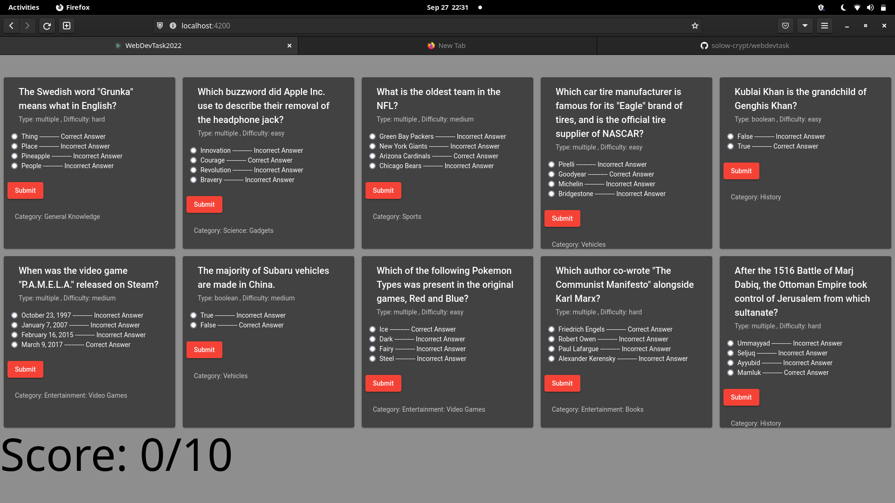

# WebDevTask2022 by Soham Padia

This project was generated with [Angular CLI](https://github.com/angular/angular-cli) version 14.2.1.

## Steps to start on independent platform
#### Requirements:
[Node](https://nodejs.org/en/download/) and [git-scm](https://git-scm.com/) should be installed

#### Steps:
1) Go to preferred directory in cmd or terminal and type `git clone https://github.com/solow-crypt/webdevtask.git`
2) After the package is installed, `cd webdevgdsc`
3) Finally type `npm install` and `npm start`

## Development server

Run `npm start` for a dev server. Navigate to http://localhost:4200/. The application will automatically reload if you change any of the source files.

## Screenshot

